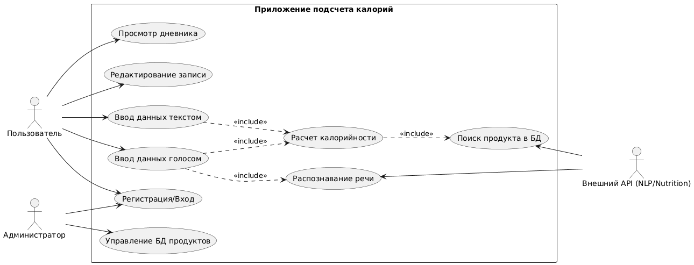
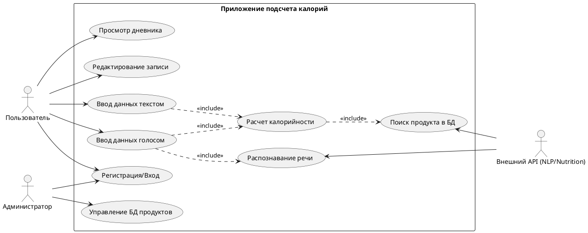

# Лабораторная работа №1

**Тема:** Формулирование требований к программной системе
**Цель работы:** Научиться анализировать поставленную задачу, формулировать функциональные и нефункциональные требования к проектируемой системе.

## Перечень заинтересованных лиц (стейкхолдеров)

1.  **Конечный пользователь (User):** Человек, следящий за питанием, желающий быстро узнавать калорийность блюд и вести дневник питания. Заинтересован в скорости ввода данных (голосом), точности распознавания и простоте интерфейса.
2.  **Администратор системы (Admin):** Лицо, отвечающее за техническую поддержку приложения, управление учетными записями пользователей и модерацию/обновление базы данных продуктов (если она локальная).
3.  **Научный руководитель:** Заинтересован в том, чтобы приложение соответствовало требованиям дипломной работы, демонстрировало использование современных технологий (NLP, Speech-to-Text) и было успешно защищено.
4.  **Поставщики внешних API (API Providers):** Сторонние сервисы, предоставляющие функционал распознавания речи (например, Yandex SpeechKit/Google Cloud STT) и базы данных продуктов (например, FatSecret Platform API или Edamam). Их интерес косвенный (использование их сервисов), но их ограничения влияют на систему.

## Перечень функциональных требований

**Для Пользователя:**
1.  **Регистрация и авторизация:** Система должна позволять пользователю создать аккаунт и войти в него для сохранения истории.
2.  **Ввод данных голосом:** Система должна принимать аудиосообщение от пользователя с перечнем съеденных продуктов.
3.  **Ввод данных текстом:** Система должна предоставлять текстовое поле для ручного ввода описания блюда.
4.  **Распознавание продуктов и веса:** Система должна извлекать из текста (или транскрибированного голоса) сущности: название продукта и его количество/вес (например, "200 грамм гречки").
5.  **Расчет калорийности:** Система должна запрашивать данные о КБЖУ (калории, белки, жиры, углеводы) найденных продуктов из базы данных и суммировать их.
6.  **Просмотр дневника питания:** Система должна отображать список приемов пищи за текущий день с итоговой суммой калорий.
7.  **Редактирование записи:** Пользователь должен иметь возможность скорректировать распознанный текст или вес продукта, если система ошиблась.

**Для Администратора:**
1.  **Управление пользователями:** Возможность просмотра списка пользователей и их блокировки.
2.  **Добавление продуктов (опционально):** Возможность вручную добавить редкое блюдо в локальный кэш/базу данных, если оно не найдено во внешнем API.

## Диаграмма вариантов использования (Use Case Diagram)

Ниже представлено описание диаграммы и код для ее генерации (например, через PlantUML), а также текстовое описание связей.

**(Текстовое описание схемы):**
*   **Актер "Пользователь"** инициирует варианты использования: Ввод голосом, Ввод текстом, Просмотр статистики, Редактирование записи.
*   **Актер "Внешний API"** участвует в вариантах: Распознавание речи, Поиск продукта.
*   Вариант "Ввод голосом" **включает (include)** вариант "Распознавание речи".
*   Варианты "Ввод голосом" и "Ввод текстом" **включают** вариант "Расчет калорийности".
*   "Расчет калорийности" **включает** "Поиск продукта".

## Перечень сделанных предположений

1.  **Наличие Интернет-соединения:** Предполагается, что устройство пользователя постоянно подключено к Интернету, так как обработка голоса и запрос к обширной базе продуктов будут выполняться через облачные API (хранить всю базу продуктов на устройстве нецелесообразно).
2.  **Язык интерфейса и ввода:** Основной язык приложения и голосовых команд — русский. Обработка других языков в первой версии не предусматривается.
3.  **Использование сторонних API:** Разработка собственной базы данных химического состава продуктов (десятки тысяч позиций) не входит в задачу. Будет использоваться готовое открытое API.
4.  **Мобильная платформа:** Приложение разрабатывается для мобильных устройств (Android/iOS) или как кроссплатформенное (Flutter/React Native), так как сценарий использования "на ходу" подразумевает смартфон, а не ПК. Не исключен вариант создания телеграм-бота.
5.  **Контекст ввода:** Предполагается, что пользователь называет вес или меру объема (штуки, стаканы). Если вес не назван, система подставляет "стандартную порцию" (100г или 1 шт) по умолчанию.

## Перечень нефункциональных требований

В соответствии с классификацией архитектурных характеристик (по Ричардсу и Форду), выделены ключевые требования:

1.  **Производительность (Performance / Responsiveness):**
    *   *Требование:* Время от момента окончания записи голосового сообщения до вывода информации о калорийности на экран не должно превышать 3-5 секунд (при стабильном 4G/Wi-Fi).
    *   *Обоснование:* Пользователи мобильных приложений не любят ждать. Долгая обработка приведет к отказу от использования голосовой функции.

2.  **Точность (Accuracy):**
    *   *Требование:* Точность распознавания названий продуктов питания из речи должна составлять не менее 90% в тихой обстановке.
    *   *Обоснование:* Критически важно для доверия к системе. Если приложение путает "капусту" с "лангустом", расчет калорий будет неверным.

3.  **Модифицируемость (Modifiability):**
    *   *Требование:* Архитектура должна позволять замену провайдера API распознавания речи или базы продуктов без переписывания основной логики приложения (использование паттерна Адаптер).
    *   *Обоснование:* Внешние API могут стать платными, закрыться или изменить условия. Студенческий проект должен быть гибким к таким изменениям.

4.  **Удобство использования (Usability):**
    *   *Требование:* Запись голоса должна осуществляться нажатием и удержанием одной кнопки (или нажатием старт/стоп), расположенной в доступной зоне большого пальца (Fitts's Law).
    *   *Обоснование:* Основной кейс — быстрый ввод данных "на бегу". Интерфейс не должен быть перегружен.
