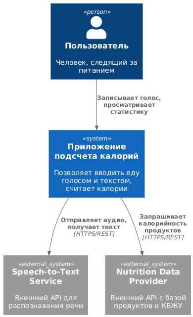
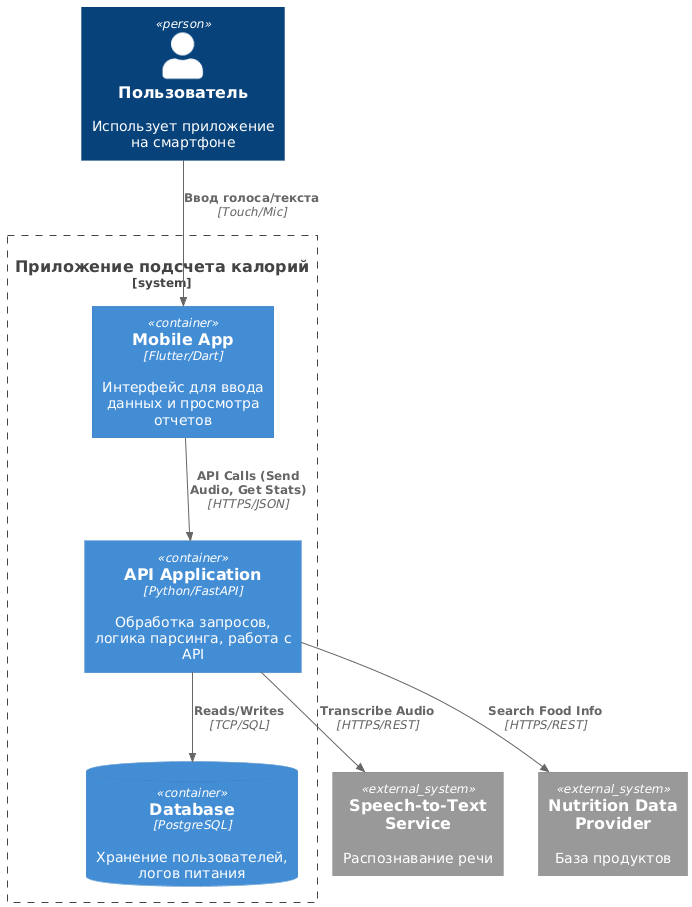
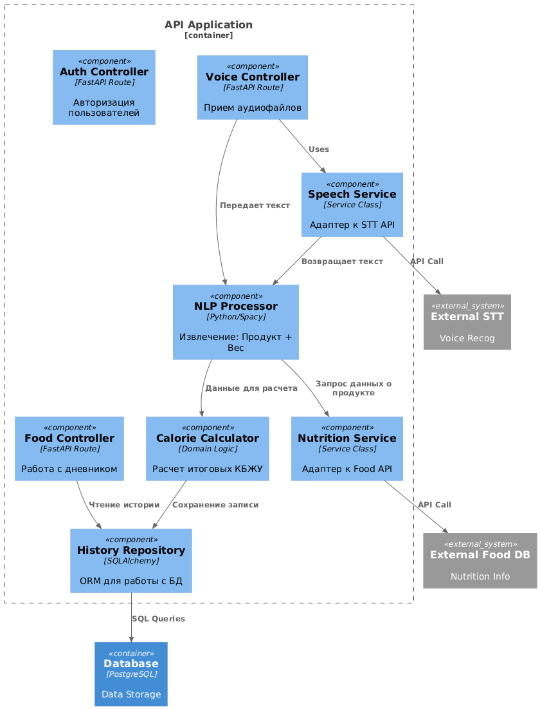
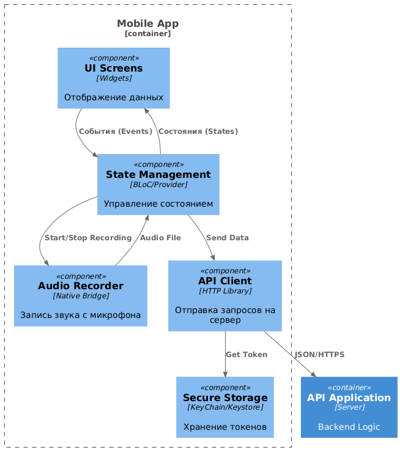

# Лабораторная работа №2

**Тема:** Использование нотации C4 model для проектирования архитектуры программной системы
**Цель работы:** Получить опыт использования графической нотации для фиксации архитектурных решений.

## Диаграмма системного контекста (System Context Diagram)

На этом уровне мы определяем границы системы и её взаимодействие с внешним миром.

**Основные элементы диаграммы:**
*   **Пользователь:** Человек, который хочет подсчитать калории.
*   **Calorie Counter System (Разрабатываемая система):** "Черный ящик", который предоставляет функционал.
*   **External Speech-to-Text System:** Внешний сервис (например, Yandex SpeechKit или Google Cloud STT) для преобразования аудио в текст.
*   **External Nutrition Data Provider:** Внешняя база данных (например, FatSecret API) для получения КБЖУ продуктов.

**Код диаграммы (PlantUML):**

```plantuml
@startuml
!include https://raw.githubusercontent.com/plantuml-stdlib/C4-PlantUML/master/C4_Context.puml

Person(user, "Пользователь", "Человек, следящий за питанием")
System(system, "Приложение подсчета калорий", "Позволяет вводить еду голосом и текстом, считает калории")

System_Ext(stt_api, "Speech-to-Text Service", "Внешний API для распознавания речи")
System_Ext(food_api, "Nutrition Data Provider", "Внешний API с базой продуктов и КБЖУ")

Rel(user, system, "Записывает голос, просматривает статистику")
Rel(system, stt_api, "Отправляет аудио, получает текст", "HTTPS/REST")
Rel(system, food_api, "Запрашивает калорийность продуктов", "HTTPS/REST")
@enduml
```

---

## Диаграмма контейнеров (Container Diagram)

На этом уровне мы раскрываем "черный ящик" системы, показывая её развертываемые единицы и сетевое взаимодействие.

**Основные элементы диаграммы:**
1.  **Mobile App (Контейнер):** Клиентское приложение (Flutter/React Native) на устройстве пользователя. Отвечает за UI и запись аудио.
2.  **API Application (Контейнер):** Серверная часть (Backend, например, на Python FastAPI). Отвечает за бизнес-логику, оркестрацию запросов к внешним API и обработку данных.
3.  **Database (Контейнер):** Реляционная база данных (PostgreSQL) для хранения пользователей и истории питания.

**Обоснование выбора архитектурного стиля:**
Выбран стиль **Многослойная архитектура (Layered Architecture)** в реализации **Клиент-Сервер**.
*   **Причина 1 (Масштабируемость):** Вынесение тяжелой логики обработки данных на сервер (API Application) позволяет не нагружать мобильное устройство и легко обновлять алгоритмы парсинга без обновления самого мобильного приложения.
*   **Причина 2 (Безопасность):** Ключи доступа к платным внешним API (STT, Food DB) должны храниться на сервере, а не в коде мобильного приложения.
*   **Причина 3 (Сетевое взаимодействие):** Топология подразумевает четкое разделение: Клиент (Mobile) <-> Сеть <-> Сервер (API) <-> БД.

**Код диаграммы (PlantUML):**

```plantuml
@startuml
!include https://raw.githubusercontent.com/plantuml-stdlib/C4-PlantUML/master/C4_Container.puml

Person(user, "Пользователь", "Использует приложение на смартфоне")

System_Boundary(c1, "Приложение подсчета калорий") {
    Container(mobile_app, "Mobile App", "Flutter/Dart", "Интерфейс для ввода данных и просмотра отчетов")
    Container(api_app, "API Application", "Python/FastAPI", "Обработка запросов, логика парсинга, работа с API")
    ContainerDb(database, "Database", "PostgreSQL", "Хранение пользователей, логов питания")
}

System_Ext(stt_api, "Speech-to-Text Service", "Распознавание речи")
System_Ext(food_api, "Nutrition Data Provider", "База продуктов")

Rel(user, mobile_app, "Ввод голоса/текста", "Touch/Mic")
Rel(mobile_app, api_app, "API Calls (Send Audio, Get Stats)", "HTTPS/JSON")
Rel(api_app, database, "Reads/Writes", "TCP/SQL")
Rel(api_app, stt_api, "Transcribe Audio", "HTTPS/REST")
Rel(api_app, food_api, "Search Food Info", "HTTPS/REST")
@enduml
```

---

## Диаграмма компонентов (Component Diagram)

В рамках данной работы (с учетом повышенной сложности) детализированы два ключевых контейнера: Серверная часть (API Application) и Клиентская часть (Mobile App).

### 1. Диаграмма компонентов для "API Application" (Backend)

Этот контейнер является ядром системы.

**Описание компонентов:**
*   **Voice Controller:** Точка входа для загрузки аудиофайлов.
*   **Food Controller:** Точка входа для текстовых запросов и получения статистики.
*   **Speech Service:** Адаптер, инкапсулирующий логику работы с внешним STT API.
*   **NLP Processor:** Компонент для извлечения сущностей (название продукта, вес) из "сырого" текста.
*   **Nutrition Service:** Адаптер для работы с внешним API продуктов.
*   **Calorie Calculator:** Доменная логика суммирования калорий.
*   **History Repository:** Слой доступа к данным (DAO) для сохранения записей в БД.

**Код диаграммы (PlantUML):**

```plantuml
@startuml
!include https://raw.githubusercontent.com/plantuml-stdlib/C4-PlantUML/master/C4_Component.puml

Container(db, "Database", "PostgreSQL", "Data Storage")
System_Ext(stt, "Speech-to-Text Service", "Распознавание речи")
System_Ext(food, "Nutrition Data Provider", "База продуктов")
Container(mobile_app, "Mobile App", "Flutter/Dart", "Интерфейс для ввода данных и просмотра отчетов")

Container_Boundary(api, "API Application") {
    Component(sign_in, "Auth Controller", "FastAPI Route", "Авторизация пользователей")
    Component(voice_ctrl, "Voice Controller", "FastAPI Route", "Прием аудиофайлов")
    Component(food_ctrl, "Food Controller", "FastAPI Route", "Работа с дневником")
    
    Component(speech_srv, "Speech Service", "Service Class", "Адаптер к STT API")
    Component(nlp, "NLP Processor", "Python/Spacy", "Извлечение: Продукт + Вес")
    Component(nutr_srv, "Nutrition Service", "Service Class", "Адаптер к Food API")
    Component(auth_srv, "Auth Service", "Service Class", "Сервис для работы с авторизацией")
    Component(calc, "Calorie Calculator", "Domain Logic", "Расчет итоговых КБЖУ")
    
    Component(repo, "History Repository", "SQLAlchemy", "ORM для работы с БД")
    Component(auth_repo, "Auth Repository", "SQLAlchemy", "ORM для работы с БД")

    Rel(sign_in, auth_srv, "Uses")
    Rel(auth_srv, auth_repo, "Uses")
    Rel(auth_repo, db, "Uses")

    Rel(mobile_app, sign_in, "Uses")
    Rel(mobile_app, voice_ctrl, "Uses")
    Rel(mobile_app, food_ctrl, "Uses")
    Rel(voice_ctrl, speech_srv, "Uses")
    Rel(speech_srv, stt, "API Call")
    Rel(speech_srv, nlp, "Возвращает текст")
    Rel(voice_ctrl, nlp, "Передает текст")
    
    Rel(nlp, nutr_srv, "Запрос данных о продукте")
    Rel(nutr_srv, food, "API Call")
    
    Rel(nlp, calc, "Данные для расчета")
    Rel(food_ctrl, repo, "Чтение истории")
    Rel(calc, repo, "Сохранение записи")
}

Rel(repo, db, "SQL Queries")
@enduml
```

### 2. Диаграмма компонентов для "Mobile App" (Повышенная сложность)

Клиентское приложение, отвечающее за взаимодействие с пользователем.

**Описание компонентов:**
*   **UI Views:** Экраны приложения (Главная, Запись, Настройки).
*   **Audio Recorder:** Компонент для работы с микрофоном устройства и кодирования аудио.
*   **State Management:** (например, BLoC или Redux) Управление состоянием приложения.
*   **API Client:** Обертка над HTTP-клиентом (например, Dio/Retrofit) для общения с нашим Бэкендом.
*   **Local Storage:** Хранение JWT-токена авторизации.

**Код диаграммы (PlantUML):**

```plantuml
@startuml
!include https://raw.githubusercontent.com/plantuml-stdlib/C4-PlantUML/master/C4_Component.puml

Container(backend, "API Application", "Server", "Backend Logic")
Person(user, "Пользователь", "Человек, следящий за питанием")
Container_Boundary(mobile, "Mobile App") {
    Component(ui, "UI Screens", "Widgets", "Отображение данных")
    Component(state, "State Management", "BLoC/Provider", "Управление состоянием")
    Component(recorder, "Audio Recorder", "Native Bridge", "Запись звука с микрофона")
    Component(api_client, "API Client", "HTTP Library", "Отправка запросов на сервер")
    Component(storage, "Secure Storage", "KeyChain/Keystore", "Хранение токенов")

    Rel(user, ui, "Взаимодействует с")

    Rel(ui, state, "События (Events)")
    Rel(state, ui, "Состояния (States)")
    
    Rel(state, recorder, "Start/Stop Recording")
    Rel(recorder, state, "Audio File")
    
    Rel(state, api_client, "Send Data")
    Rel(api_client, storage, "Get Token")
}

Rel(api_client, backend, "JSON/HTTPS")
@enduml
```
