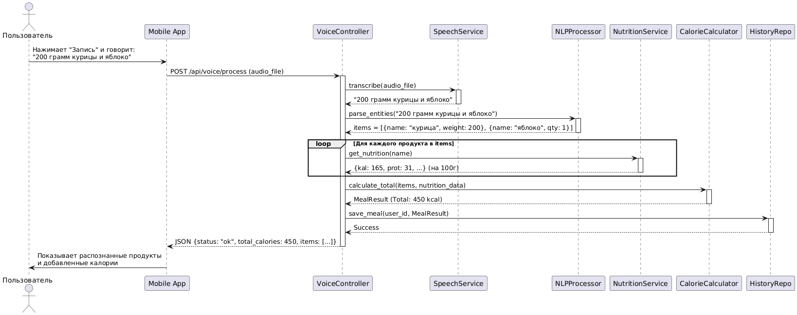
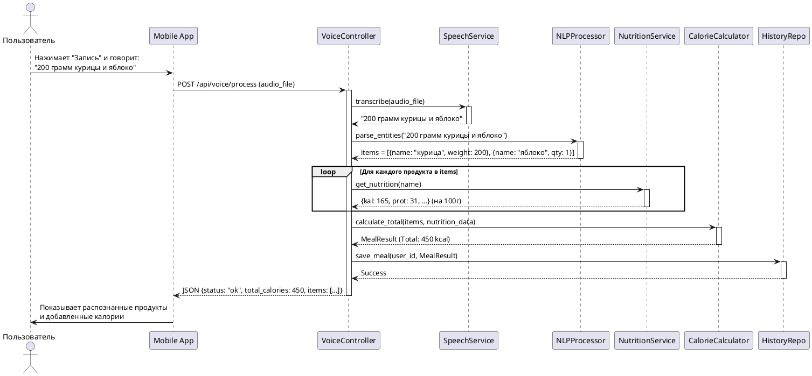
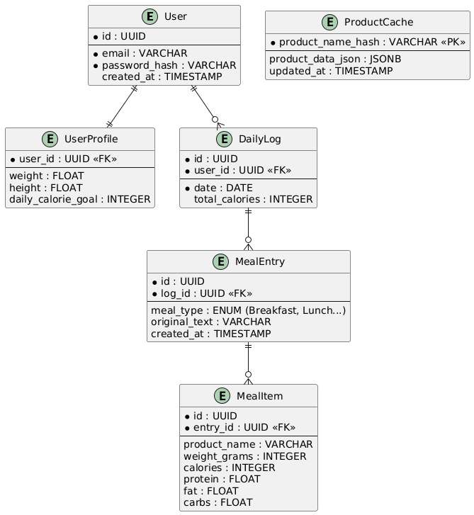
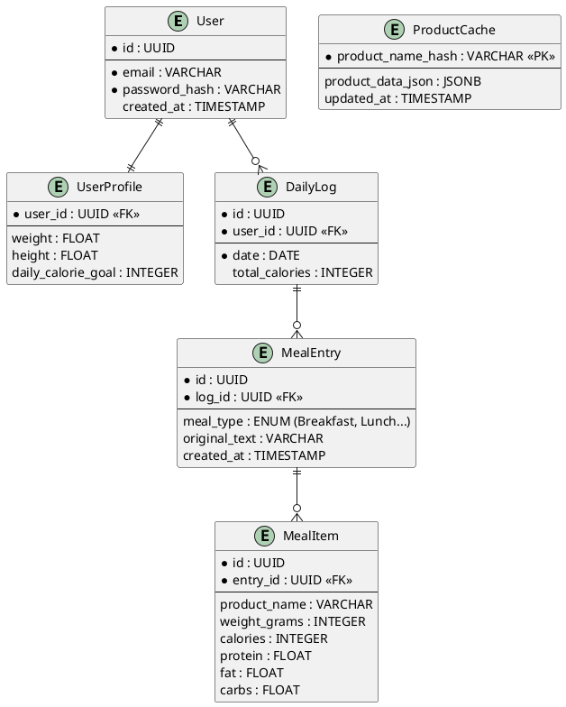

# Лабораторная работа №3

**Тема:** Использование принципов проектирования на уровне методов и классов
**Цель работы:** Получить опыт проектирования и реализации модулей с использованием принципов KISS, YAGNI, DRY, SOLID и др.

## Диаграмма контейнеров

В качестве основы используется архитектура, разработанная в Лабораторной работе №2.
*Контейнер API Application будет детализирован далее.*


## Диаграмма компонентов

Диаграмма компонентов для серверной части (**API Application**), которая реализует основную бизнес-логику обработки голоса и расчета калорий.


## Диаграмма последовательностей

Рассмотрим сценарий использования: **"Добавление приема пищи через голосовое сообщение"**.

**Участники:**
1.  **Mobile App:** Клиентское приложение.
2.  **VoiceController:** HTTP-контроллер, принимающий аудио.
3.  **SpeechService:** Сервис-адаптер для STT.
4.  **NLPProcessor:** Сервис обработки естественного языка.
5.  **NutritionService:** Сервис поиска КБЖУ.
6.  **CalorieCalculator:** Утилита расчета сумм.
7.  **HistoryRepo:** Репозиторий базы данных.





## Модель БД (UML Class Diagram)

Спроектирована схема реляционной базы данных (PostgreSQL).
**Сущности:**
1.  **User:** Данные пользователя.
2.  **UserProfile:** Антропометрия (вес, рост) для расчета нормы калорий.
3.  **DailyLog:** "Шапка" дневника за конкретную дату.
4.  **MealEntry:** Конкретная запись о приеме пищи (завтрак, обед и т.д.).
5.  **ProductCache:** Кэш продуктов из внешнего API (чтобы не платить за повторные запросы одних и тех же продуктов).





## Применение основных принципов разработки

Ниже представлен код на Python (Backend) и псевдокод клиента, демонстрирующий применение принципов.

### 1. Серверная часть (Принципы SOLID, SoC)

```python
from abc import ABC, abstractmethod
from dataclasses import dataclass
from typing import List

# --- Абстракции (DIP - Dependency Inversion Principle) ---
# Мы зависим от абстракций, а не от конкретных реализаций API (Google/Yandex)
class ISpeechProvider(ABC):
    @abstractmethod
    def transcribe(self, audio_bytes: bytes) -> str:
        pass

class INutritionProvider(ABC):
    @abstractmethod
    def get_info(self, product_name: str) -> dict:
        pass

# --- Реализация (SoC - Separation of Concerns) ---
# Сервис только координирует работу, но не знает деталей HTTP или SQL
class MealService:
    def __init__(self, 
                 stt: ISpeechProvider, 
                 nutrition: INutritionProvider, 
                 repo: 'MealRepository'): # Dependency Injection
        self.stt = stt
        self.nutrition = nutrition
        self.repo = repo

    def process_voice_meal(self, user_id: int, audio: bytes):
        # 1. Распознавание
        text = self.stt.transcribe(audio)
        if not text:
            raise ValueError("Could not recognize speech")

        # 2. Парсинг (вынесен в отдельную чистую функцию - SRP)
        # KISS: Используем простую эвристику вместо сложной ML-модели для начала
        items = self._simple_parse_text(text) 
        
        meal_entry = MealEntry(user_id=user_id, text=text)
        
        # 3. Обогащение данными
        for item in items:
            nutr_info = self.nutrition.get_info(item['name'])
            # DRY: Логика расчета калорий на вес вынесена в модель Item или утилиту
            meal_entry.add_item(item['name'], item['weight'], nutr_info)

        # 4. Сохранение
        self.repo.save(meal_entry)
        return meal_entry

    def _simple_parse_text(self, text: str) -> List[dict]:
        # YAGNI: Пока не делаем сложный NLP, считаем, что пользователь говорит
        # "200 грамм яблоко". Если формат сложнее - это задача будущих версий.
        # ...логика парсинга...
        pass
```

### 2. Клиентская часть (DRY, KISS)

```dart
// Mobile App (Flutter snippet)

class ApiClient {
  final String baseUrl;
  
  ApiClient(this.baseUrl);

  // DRY: Единый метод для обработки ошибок и добавления заголовков
  Future<dynamic> _postRequest(String endpoint, dynamic data) async {
    try {
      final response = await http.post(
        Uri.parse('$baseUrl$endpoint'),
        headers: {'Authorization': 'Bearer $token'},
        body: data
      );
      return _handleResponse(response);
    } catch (e) {
      throw ApiException("Network error: $e");
    }
  }

  // KISS: Метод отправки голоса делает только одну вещь
  Future<MealResult> uploadVoice(File audioFile) async {
    // Простая реализация без лишних оберток
    return _postRequest('/voice/process', audioFile.readAsBytesSync());
  }
}
```

### Пояснения по принципам в коде:

1.  **SOLID (SRP - Single Responsibility Principle):** Класс `MealService` занимается только бизнес-логикой. Парсинг текста вынесен в отдельный метод (или класс), работа с БД — в `repo`, работа с сетью — в `ISpeechProvider`.
2.  **SOLID (DIP - Dependency Inversion):** `MealService` зависит от интерфейса `ISpeechProvider`, а не от конкретного класса `YandexSpeechKit`. Это позволяет легко подменить распознавание речи на Google или мок-объект для тестов.
3.  **KISS (Keep It Simple, Stupid):** В методе `_simple_parse_text` мы сознательно отказываемся от подключения тяжелых нейросетей для NLP на старте, используя простые регулярные выражения или строковые функции, пока этого достаточно.
4.  **YAGNI (You Aren't Gonna Need It):** В модели БД мы создали таблицу `ProductCache`, но в коде примера пока не реализуем сложную логику инвалидации кэша и очередей обновлений, так как на этапе MVP это избыточно.
5.  **DRY (Don't Repeat Yourself):** В клиентском коде логика настройки HTTP-запросов (заголовки, токены) вынесена в приватный метод `_postRequest`, чтобы не дублировать её в каждом методе API.

---

## Дополнительные принципы разработки (Повышенная сложность)

### 1. BDUF (Big Design Up Front)
**Решение: Отказ.**
*Обоснование:* В контексте студенческой/дипломной работы и стартапа невозможно заранее предусмотреть все нюансы работы внешних API (качество распознавания речи, форматы ответов базы продуктов). Попытка спроектировать всё до мельчайших деталей приведет к потере времени. Используется итеративный подход: сначала делаем простую версию (голос -> текст -> калории), затем усложняем.

### 2. SoC (Separation of Concerns)
**Решение: Применение.**
*Обоснование:* Это фундаментальный принцип для выбранной слоистой архитектуры (Layered Architecture).
*   *UI* не знает, как считаются калории.
*   *Бэкенд* не знает, как рисуется график на телефоне.
*   *Логика расчета* отделена от *хранения данных*.
Это критически важно для возможности замены компонентов (например, смены PostgreSQL на MongoDB или Flutter на React Native) без переписывания всей системы.

### 3. MVP (Minimum Viable Product)
**Решение: Применение.**
*Обоснование:* Для первой версии ("лабораторной" или защиты диплома) необходимо реализовать только "киллер-фичу": распознавание голоса и получение цифры калорий.
Функции вроде "социальная сеть для худеющих", "интеграция с умными часами", "подробный анализ микроэлементов" отсекаются, чтобы уложиться в сроки и проверить гипотезу удобства голосового ввода.

### 4. PoC (Proof of Concept)
**Решение: Применение (частично).**
*Обоснование:* Перед началом полноценной разработки Бэкенда необходимо сделать PoC для связки "STT + NLP". Нужно написать маленький скрипт, который отправляет в SpeechKit фразу "200 грамм гречки" и проверяет, сможет ли NLP корректно выделить сущности "Гречка" и "200 г". Если точность будет низкой, архитектуру придется менять (например, добавлять этап ручного подтверждения пользователем), поэтому PoC необходим для снижения рисков.
