# Лабораторная работа №4

**Тема:** Проектирование REST API  
**Цель работы:** Получить опыт проектирования программного интерфейса.

## Контекст и связь с ЛР1-ЛР3
В ЛР1-ЛР3 была спроектирована система учета калорийности с голосовым вводом (Mobile App + API Application + внешние STT/Nutrition сервисы).  
В ЛР4 реализован REST API для контейнера `API Application` с endpoint'ами для:
- работы с приемами пищи;
- голосовой обработки записи приема пищи;
- получения дневной сводки;
- работы со справочником продуктов.
Хранение данных реализовано на **SQLite** (`api/lab4.sqlite3`) с автоматическим сидированием при старте приложения.

## Документация по API

### Принятые проектные решения (не менее 8)
1. **Версионирование API через префикс `/api/v1`**. Это позволяет добавлять новые версии без поломки клиентов.
2. **Единый формат обмена JSON (`application/json`)**. Упрощает интеграцию мобильного клиента и автотестов.
3. **Использование UUID для идентификаторов (`meal_id`, `user_id`)**. Уменьшает риск коллизий и утечки информации о количестве записей.
4. **Разделение ресурсов по доменам**: `meals`, `voice`, `reports`, `products`. Это повышает читаемость и масштабируемость контракта.
5. **Идемпотентность для `PUT` и `DELETE`** на уровне ресурса `meal`. Повторный `PUT` с тем же телом не меняет итог, `DELETE` удаляет ресурс полностью.
6. **Явная валидация входных данных через Pydantic**: ограничения на длины строк, допустимые enum-значения, диапазоны веса/калорий.
7. **Использование кодов статуса по REST-правилам**: `200`, `201`, `204`, `404`, `422`.
8. **Детерминированный расчет калорий на сервере**: `calories_total = round(weight_grams * calories_per_100g / 100)`.
9. **Сводный endpoint отчета** `/api/v1/reports/day-summary` вместо вычисления на клиенте. Это снижает связность и дублирование логики.
10. **MVP-подход для голосового endpoint**: в `POST /api/v1/voice/process` используется простое правило парсинга текста (без тяжелого NLP), что соответствует принципам из ЛР3.

### Формат данных
- **Запросы и ответы:** `JSON`
- **Дата:** `YYYY-MM-DD`
- **Время:** `ISO 8601` (UTC)
- **Идентификаторы:** `UUID`

### Реализованные endpoint’ы

#### 1) `GET /health`
**Описание:** Проверка доступности сервиса.  
**Параметры:** нет.

**Пример ответа `200`:**
```json
{
  "status": "ok"
}
```

---

#### 2) `GET /api/v1/products`
**Описание:** Получение списка продуктов со справочной калорийностью.  
**Query params:**
- `q` *(optional, string)*: фильтр по части названия.

**Пример запроса:**
`GET /api/v1/products?q=apple`

**Пример ответа `200`:**
```json
{
  "products": [
    {
      "product_name": "apple",
      "calories_per_100g": 52
    }
  ]
}
```

---

#### 3) `POST /api/v1/meals`
**Описание:** Создание записи приема пищи.  
**Body (JSON):**
```json
{
  "user_id": "77f496bb-9f04-48be-a03d-cb3ccf6c10a5",
  "meal_type": "lunch",
  "meal_date": "2026-02-18",
  "original_text": "200g chicken and 150g rice",
  "items": [
    {
      "product_name": "chicken breast",
      "weight_grams": 200,
      "calories_per_100g": 165
    }
  ]
}
```

**Пример ответа `201`:**
```json
{
  "id": "f2bfc9dc-f44a-4f35-a85c-8cf9184fdc3d",
  "user_id": "77f496bb-9f04-48be-a03d-cb3ccf6c10a5",
  "meal_type": "lunch",
  "meal_date": "2026-02-18",
  "original_text": "200g chicken and 150g rice",
  "total_calories": 525,
  "items": [
    {
      "product_name": "chicken breast",
      "weight_grams": 200,
      "calories_per_100g": 165,
      "calories_total": 330
    }
  ],
  "created_at": "2026-02-18T20:00:00.000000",
  "updated_at": "2026-02-18T20:00:00.000000"
}
```

---

#### 4) `GET /api/v1/meals`
**Описание:** Получение списка приемов пищи за дату.  
**Query params:**
- `user_id` *(required, UUID)*
- `meal_date` *(required, date)*

**Пример запроса:**
`GET /api/v1/meals?user_id=77f496bb-9f04-48be-a03d-cb3ccf6c10a5&meal_date=2026-02-18`

**Пример ответа `200`:**
```json
[
  {
    "id": "f2bfc9dc-f44a-4f35-a85c-8cf9184fdc3d",
    "meal_type": "lunch",
    "total_calories": 525,
    "items": []
  }
]
```

---

#### 5) `GET /api/v1/meals/{meal_id}`
**Описание:** Получение одной записи приема пищи по идентификатору.

**Пример ответа `200`:**
```json
{
  "id": "f2bfc9dc-f44a-4f35-a85c-8cf9184fdc3d",
  "meal_type": "lunch",
  "total_calories": 525
}
```

**Пример ответа `404`:**
```json
{
  "detail": "Meal not found"
}
```

---

#### 6) `GET /api/v1/reports/day-summary`
**Описание:** Получение агрегированного отчета за день по пользователю.

**Query params:**
- `user_id` *(required, UUID)*
- `meal_date` *(required, date)*

**Пример ответа `200`:**
```json
{
  "user_id": "77f496bb-9f04-48be-a03d-cb3ccf6c10a5",
  "meal_date": "2026-02-18",
  "meals_count": 2,
  "total_calories": 690
}
```

---

#### 7) `POST /api/v1/voice/process`
**Описание:** Создание приема пищи на основе голосовой/текстовой фразы.

**Body (JSON):**
```json
{
  "user_id": "77f496bb-9f04-48be-a03d-cb3ccf6c10a5",
  "text": "I ate chicken and apple",
  "meal_type": "dinner",
  "meal_date": "2026-02-18"
}
```

**Пример ответа `201`:**
```json
{
  "id": "3ce88df9-acb8-4ac1-8063-47d0e0744d62",
  "total_calories": 408,
  "items": [
    {
      "product_name": "chicken breast",
      "weight_grams": 200,
      "calories_total": 330
    },
    {
      "product_name": "apple",
      "weight_grams": 150,
      "calories_total": 78
    }
  ]
}
```

---

#### 8) `PUT /api/v1/meals/{meal_id}`
**Описание:** Обновление существующей записи приема пищи.

**Body (JSON):**
```json
{
  "meal_type": "dinner",
  "original_text": "updated meal",
  "items": [
    {
      "product_name": "banana",
      "weight_grams": 120,
      "calories_per_100g": 89
    }
  ]
}
```

**Пример ответа `200`:**
```json
{
  "id": "f2bfc9dc-f44a-4f35-a85c-8cf9184fdc3d",
  "meal_type": "dinner",
  "total_calories": 107
}
```

---

#### 9) `DELETE /api/v1/meals/{meal_id}`
**Описание:** Удаление записи приема пищи.

**Пример ответа `204`:**
Пустое тело ответа.

**Пример ответа `404`:**
```json
{
  "detail": "Meal not found"
}
```

## Реализация

### Структура
- `Lab Work №4/api/main.py` — реализация REST API + SQLite schema/seed.
- `Lab Work №4/api/requirements.txt` — зависимости.
- `Lab Work №4/api/lab4.sqlite3` — локальная база данных (создается автоматически).
- `Lab Work №4/tests/test_api.py` — автотесты через `pytest` + `TestClient`.
- `Lab Work №4/postman/Lab4_REST_API.postman_collection.json` — коллекция Postman.
- `Lab Work №4/postman/local.postman_environment.json` — окружение Postman.
- `Lab Work №4/images/` — скриншоты из Postman.

### Запуск API
```bash
cd "Lab Work №4"
python3 -m venv .venv
source .venv/bin/activate
pip install -r api/requirements.txt
uvicorn api.main:app --reload
```

При первом запуске автоматически создаются таблицы и сиды:
- справочник продуктов (`apple`, `chicken breast`, `rice`, `buckwheat`, `banana`);
- тестовая запись приема пищи (`meal_date=2026-02-18`, пользователь `77f496bb-9f04-48be-a03d-cb3ccf6c10a5`).

## Тестирование API

### Используемый инструмент
- **Postman Collection:** `Lab Work №4/postman/Lab4_REST_API.postman_collection.json`
- **Environment:** `Lab Work №4/postman/local.postman_environment.json`

### Порядок запуска в Postman
1. Импортировать коллекцию и environment.
2. Выбрать environment `lab4-local`.
3. Запустить endpoint'ы коллекции по порядку (через Collection Runner).

### Что проверяется автотестами (минимум 2 теста на endpoint)
Для каждого endpoint в Postman-скриптах есть минимум 2 проверки:
- статус ответа;
- содержимое/структура ответа (ключевые поля, массивы, значения).

### Перечень тестов
1. `GET /health`
2. `GET /api/v1/products`
3. `POST /api/v1/meals`
4. `GET /api/v1/meals`
5. `GET /api/v1/meals/{meal_id}`
6. `GET /api/v1/reports/day-summary`
7. `POST /api/v1/voice/process`
8. `PUT /api/v1/meals/{meal_id}`
9. `DELETE /api/v1/meals/{meal_id}`
10. `GET /api/v1/meals/{meal_id}` (негативный сценарий после удаления)

### Подробное оформление тестов в Postman (для отчета)
Использовать переменные:
- `{{baseUrl}} = http://127.0.0.1:8000`
- `{{userId}} = 77f496bb-9f04-48be-a03d-cb3ccf6c10a5`
- `{{mealDate}} = 2026-02-18`
- `{{mealId}}` (сохраняется после `POST /api/v1/meals`)

#### 1) Тестируемое API: `GET /health`
- Метод: `GET`
- Строка запроса: `{{baseUrl}}/health`
- Headers: не обязательны
- Params: нет
- Authorization: `No Auth`
- Body: нет
- Ожидаемый ответ:
- Status: `200 OK`
- Body: `{"status":"ok"}`
- Код автотеста (Tests):
```javascript
pm.test('Status is 200', function () {
  pm.response.to.have.status(200);
});

pm.test('Body has status=ok', function () {
  const body = pm.response.json();
  pm.expect(body.status).to.eql('ok');
});
```
- Скриншоты:
- Request: вкладки `Params`, `Authorization`, `Headers`
- Response: вкладки `Body`, `Headers`
- Test Results: вкладка `Test Results`
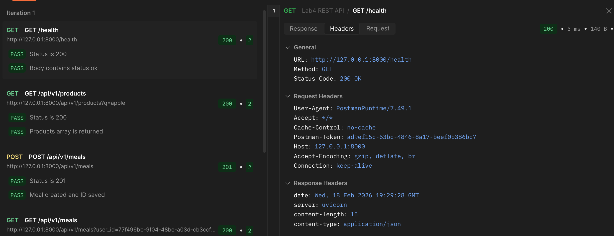
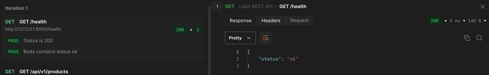

#### 2) Тестируемое API: `GET /api/v1/products`
- Метод: `GET`
- Строка запроса: `{{baseUrl}}/api/v1/products?q=apple`
- Headers: `Accept: application/json`
- Params: `q=apple`
- Authorization: `No Auth`
- Body: нет
- Ожидаемый ответ:
- Status: `200 OK`
- Body: объект с массивом `products`
- Код автотеста (Tests):
```javascript
pm.test('Status is 200', function () {
  pm.response.to.have.status(200);
});

pm.test('Products array returned', function () {
  const body = pm.response.json();
  pm.expect(body.products).to.be.an('array');
  pm.expect(body.products.length).to.be.greaterThan(0);
  pm.expect(body.products[0]).to.have.property('product_name');
  pm.expect(body.products[0]).to.have.property('calories_per_100g');
});
```
- Скриншоты:
- Request: `Params`, `Authorization`, `Headers`
- Response: `Body`, `Headers`
- Test Results
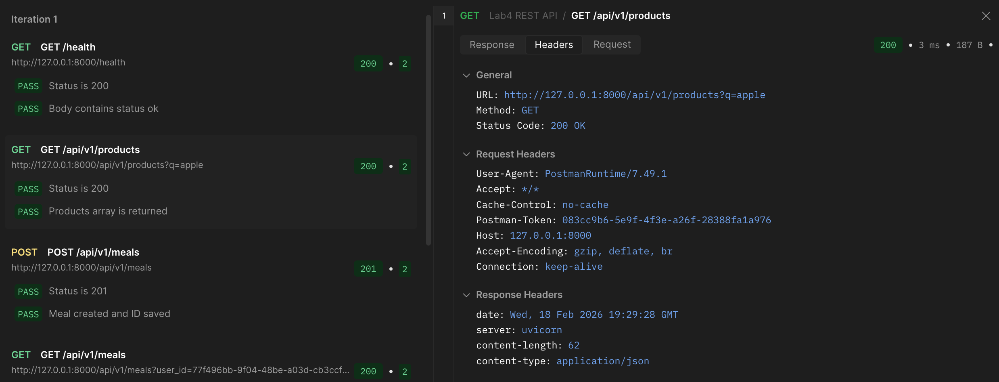
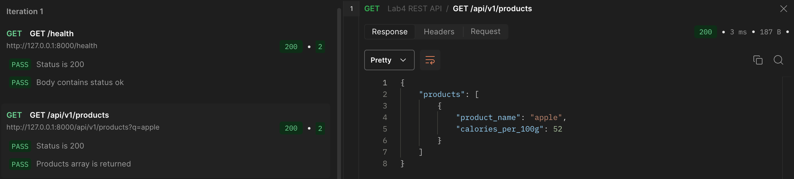

#### 3) Тестируемое API: `POST /api/v1/meals`
- Метод: `POST`
- Строка запроса: `{{baseUrl}}/api/v1/meals`
- Headers: `Content-Type: application/json`
- Params: нет
- Authorization: `No Auth`
- Body (raw JSON):
```json
{
  "user_id": "{{userId}}",
  "meal_type": "lunch",
  "meal_date": "{{mealDate}}",
  "original_text": "200g chicken and 150g rice",
  "items": [
    {
      "product_name": "chicken breast",
      "weight_grams": 200,
      "calories_per_100g": 165
    }
  ]
}
```
- Ожидаемый ответ:
- Status: `201 Created`
- Body: созданный meal с полями `id`, `total_calories`, `items`
- Код автотеста (Tests):
```javascript
pm.test('Status is 201', function () {
  pm.response.to.have.status(201);
});

pm.test('Meal created and mealId saved', function () {
  const body = pm.response.json();
  pm.expect(body.id).to.exist;
  pm.expect(body.user_id).to.eql(pm.variables.get('userId'));
  pm.expect(body.items).to.be.an('array');
  pm.expect(body.total_calories).to.be.greaterThan(0);
  pm.collectionVariables.set('mealId', body.id);
});
```
- Скриншоты:
- Request: `Headers`, `Body`
- Response: `Body`, `Headers`
- Test Results
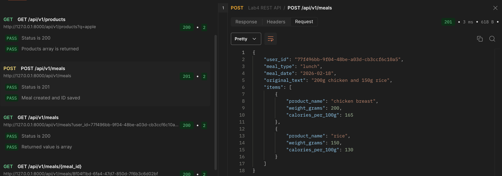
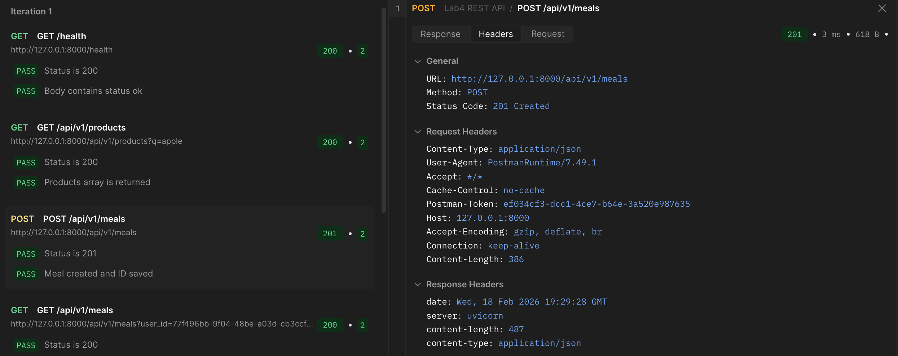
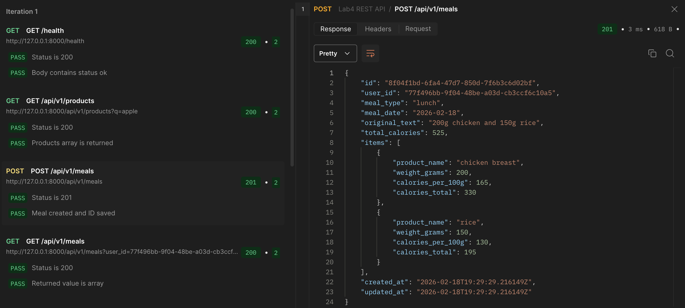

#### 4) Тестируемое API: `GET /api/v1/meals`
- Метод: `GET`
- Строка запроса: `{{baseUrl}}/api/v1/meals?user_id={{userId}}&meal_date={{mealDate}}`
- Headers: `Accept: application/json`
- Params: `user_id`, `meal_date`
- Authorization: `No Auth`
- Body: нет
- Ожидаемый ответ:
- Status: `200 OK`
- Body: массив приемов пищи
- Код автотеста (Tests):
```javascript
pm.test('Status is 200', function () {
  pm.response.to.have.status(200);
});

pm.test('Meals list contains created meal', function () {
  const body = pm.response.json();
  const mealId = pm.collectionVariables.get('mealId');
  pm.expect(body).to.be.an('array');
  pm.expect(body.some(m => m.id === mealId)).to.eql(true);
});
```
- Скриншоты:
- Request: `Params`, `Authorization`, `Headers`
- Response: `Body`, `Headers`
- Test Results
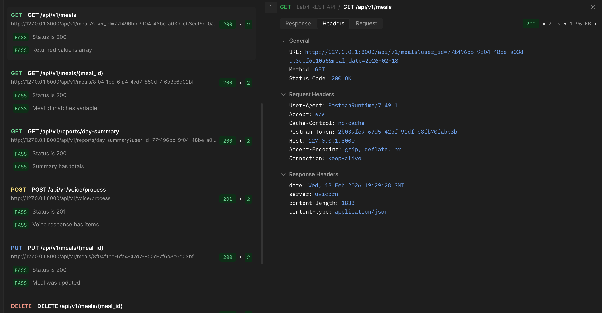
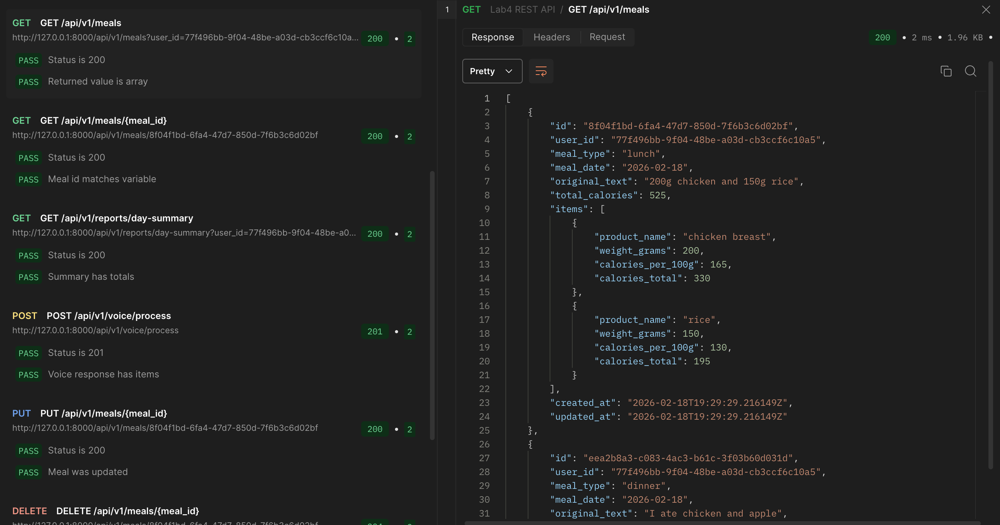

#### 5) Тестируемое API: `GET /api/v1/meals/{meal_id}`
- Метод: `GET`
- Строка запроса: `{{baseUrl}}/api/v1/meals/{{mealId}}`
- Headers: `Accept: application/json`
- Params: нет
- Authorization: `No Auth`
- Body: нет
- Ожидаемый ответ:
- Status: `200 OK`
- Body: объект meal по `mealId`
- Код автотеста (Tests):
```javascript
pm.test('Status is 200', function () {
  pm.response.to.have.status(200);
});

pm.test('Meal by id is returned', function () {
  const body = pm.response.json();
  pm.expect(body.id).to.eql(pm.collectionVariables.get('mealId'));
  pm.expect(body).to.have.property('items');
});
```
- Скриншоты:
- Request: `Authorization`, `Headers`
- Response: `Body`, `Headers`
- Test Results
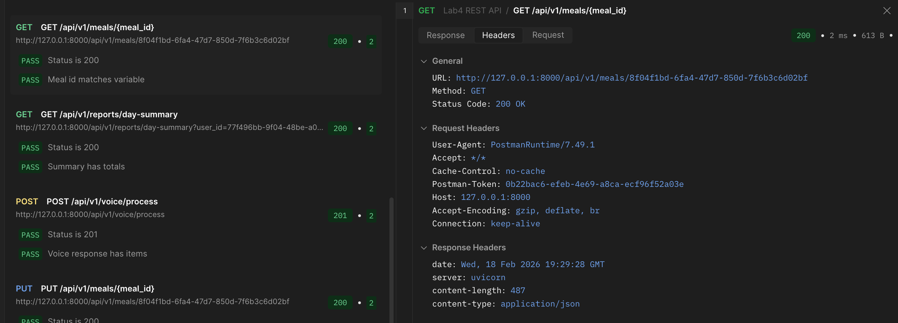
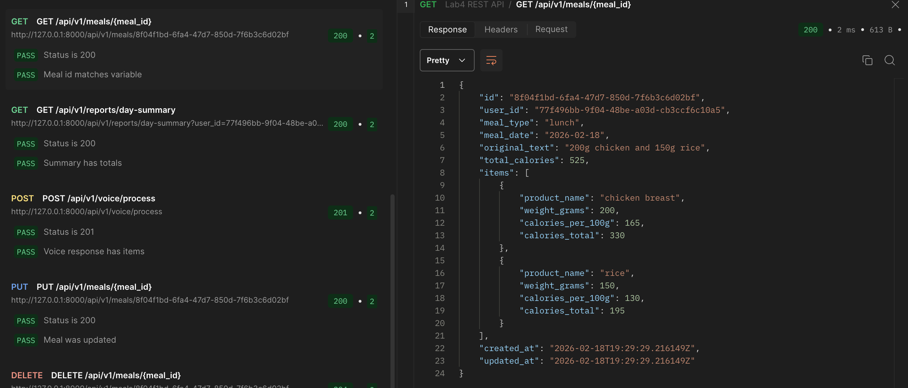

#### 6) Тестируемое API: `GET /api/v1/reports/day-summary`
- Метод: `GET`
- Строка запроса: `{{baseUrl}}/api/v1/reports/day-summary?user_id={{userId}}&meal_date={{mealDate}}`
- Headers: `Accept: application/json`
- Params: `user_id`, `meal_date`
- Authorization: `No Auth`
- Body: нет
- Ожидаемый ответ:
- Status: `200 OK`
- Body: объект с `meals_count` и `total_calories`
- Код автотеста (Tests):
```javascript
pm.test('Status is 200', function () {
  pm.response.to.have.status(200);
});

pm.test('Day summary contains aggregate values', function () {
  const body = pm.response.json();
  pm.expect(body.user_id).to.eql(pm.variables.get('userId'));
  pm.expect(body.meals_count).to.be.a('number');
  pm.expect(body.total_calories).to.be.a('number');
});
```
- Скриншоты:
- Request: `Params`, `Authorization`, `Headers`
- Response: `Body`, `Headers`
- Test Results
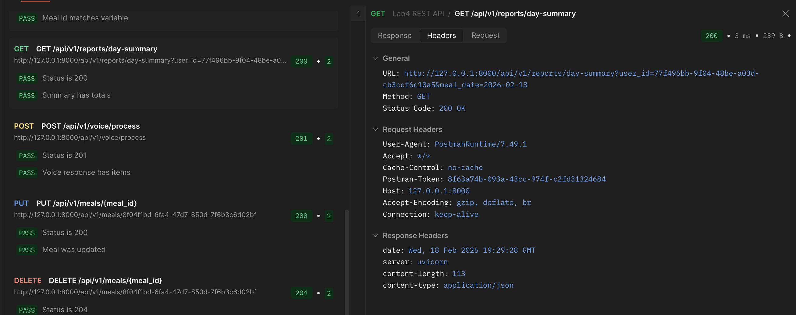
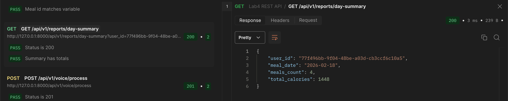

#### 7) Тестируемое API: `POST /api/v1/voice/process`
- Метод: `POST`
- Строка запроса: `{{baseUrl}}/api/v1/voice/process`
- Headers: `Content-Type: application/json`
- Params: нет
- Authorization: `No Auth`
- Body (raw JSON):
```json
{
  "user_id": "{{userId}}",
  "text": "I ate chicken and apple",
  "meal_type": "dinner",
  "meal_date": "{{mealDate}}"
}
```
- Ожидаемый ответ:
- Status: `201 Created`
- Body: созданный meal с распарсенными `items`
- Код автотеста (Tests):
```javascript
pm.test('Status is 201', function () {
  pm.response.to.have.status(201);
});

pm.test('Voice processing returns parsed items', function () {
  const body = pm.response.json();
  pm.expect(body.items).to.be.an('array');
  pm.expect(body.items.length).to.be.greaterThan(0);
  pm.expect(body.total_calories).to.be.greaterThan(0);
});
```
- Скриншоты:
- Request: `Headers`, `Body`
- Response: `Body`, `Headers`
- Test Results
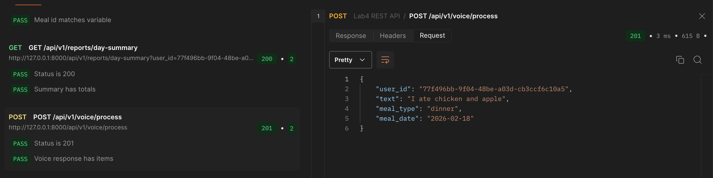
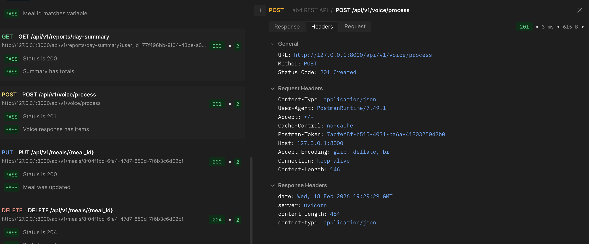
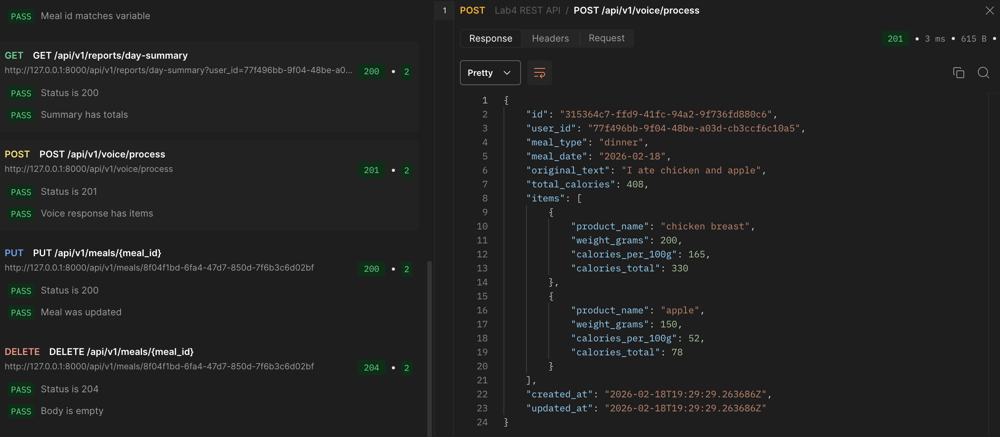

#### 8) Тестируемое API: `PUT /api/v1/meals/{meal_id}`
- Метод: `PUT`
- Строка запроса: `{{baseUrl}}/api/v1/meals/{{mealId}}`
- Headers: `Content-Type: application/json`
- Params: нет
- Authorization: `No Auth`
- Body (raw JSON):
```json
{
  "meal_type": "dinner",
  "original_text": "updated meal",
  "items": [
    {
      "product_name": "banana",
      "weight_grams": 120,
      "calories_per_100g": 89
    }
  ]
}
```
- Ожидаемый ответ:
- Status: `200 OK`
- Body: обновленный meal, `total_calories = 107`
- Код автотеста (Tests):
```javascript
pm.test('Status is 200', function () {
  pm.response.to.have.status(200);
});

pm.test('Meal updated correctly', function () {
  const body = pm.response.json();
  pm.expect(body.id).to.eql(pm.collectionVariables.get('mealId'));
  pm.expect(body.meal_type).to.eql('dinner');
  pm.expect(body.total_calories).to.eql(107);
});
```
- Скриншоты:
- Request: `Headers`, `Body`
- Response: `Body`, `Headers`
- Test Results
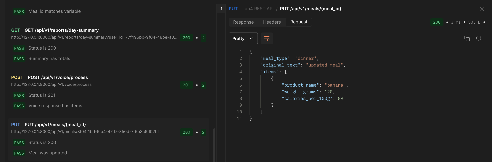
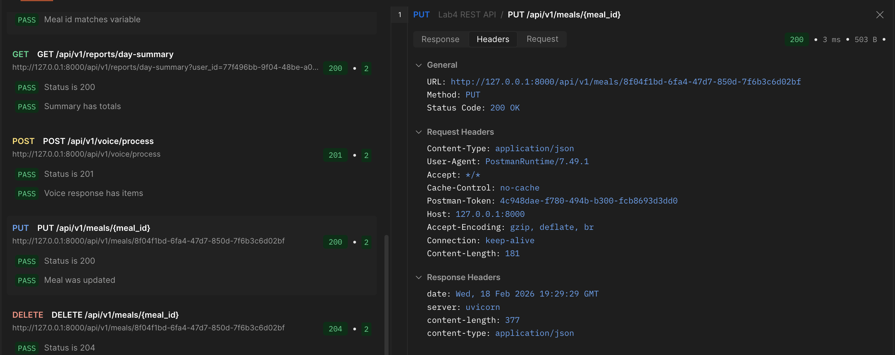
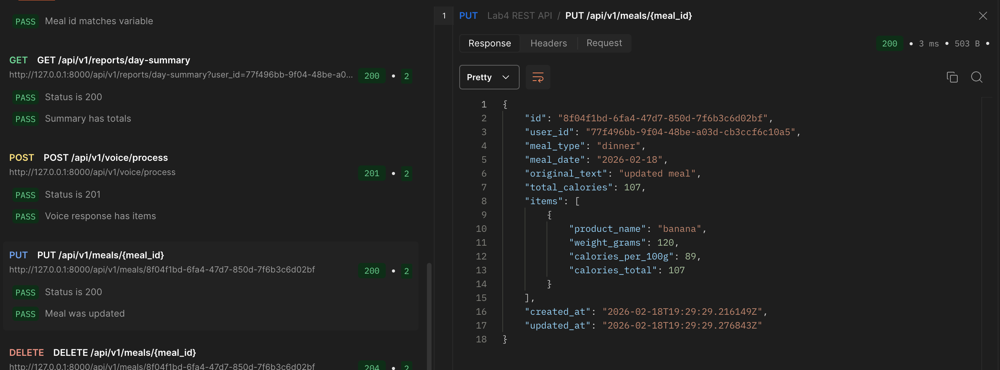

#### 9) Тестируемое API: `DELETE /api/v1/meals/{meal_id}`
- Метод: `DELETE`
- Строка запроса: `{{baseUrl}}/api/v1/meals/{{mealId}}`
- Headers: `Accept: application/json`
- Params: нет
- Authorization: `No Auth`
- Body: нет
- Ожидаемый ответ:
- Status: `204 No Content`
- Body: пустой
- Код автотеста (Tests):
```javascript
pm.test('Status is 204', function () {
  pm.response.to.have.status(204);
});

pm.test('Response body is empty', function () {
  pm.expect(pm.response.text()).to.eql('');
});
```
- Скриншоты:
- Request: `Authorization`, `Headers`
- Response: `Body` (empty), `Headers`
- Test Results
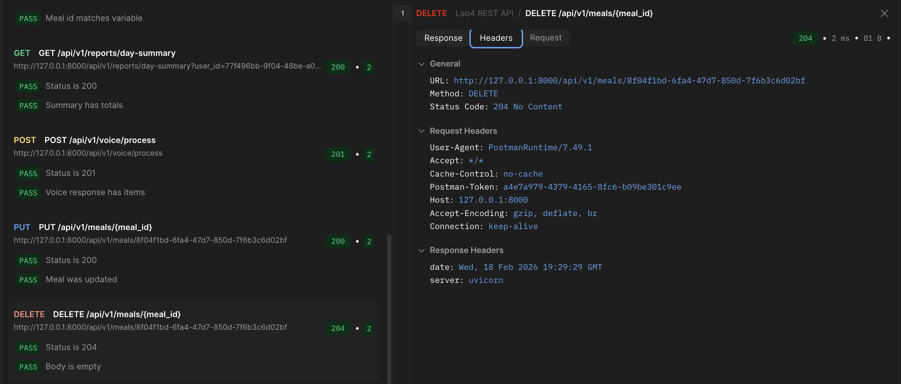

#### 10) Тестируемое API: `GET /api/v1/meals/{meal_id}` (после удаления)
- Метод: `GET`
- Строка запроса: `{{baseUrl}}/api/v1/meals/{{mealId}}`
- Headers: `Accept: application/json`
- Params: нет
- Authorization: `No Auth`
- Body: нет
- Ожидаемый ответ:
- Status: `404 Not Found`
- Body: `{"detail":"Meal not found"}`
- Код автотеста (Tests):
```javascript
pm.test('Status is 404', function () {
  pm.response.to.have.status(404);
});

pm.test('Error detail is correct', function () {
  const body = pm.response.json();
  pm.expect(body.detail).to.eql('Meal not found');
});
```
- Скриншоты:
- Request: `Authorization`, `Headers`
- Response: `Body`, `Headers`
- Test Results
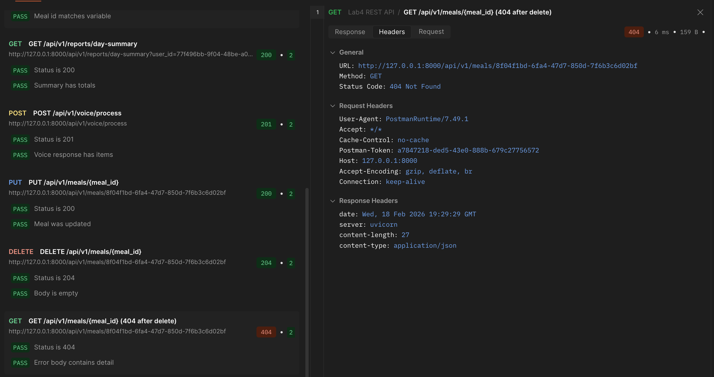
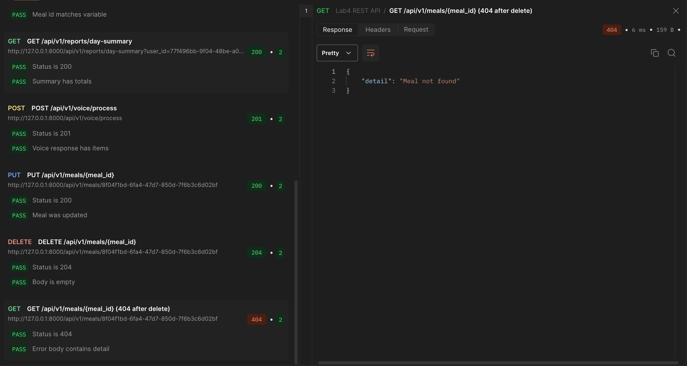

## Локальные автотесты (дополнительно)
```bash
cd "Lab Work №4"
pytest -q
```

Покрываются позитивные и негативные сценарии, включая `PUT` и `DELETE`.
