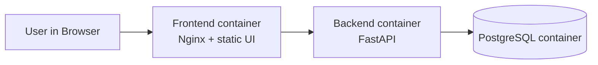

# Лабораторная работа №5

**Тема:** Реализация архитектуры на основе сервисов (микросервисной архитектуры)  
**Цель работы:** Получить опыт организации взаимодействия сервисов с использованием Docker-контейнеров.

## Контекст ЛР1-ЛР4
В ЛР1-ЛР3 была спроектирована система учета калорийности с голосовым вводом и определена контейнерная архитектура (`Mobile App` -> `API Application` -> `DB`).  
В ЛР4 был реализован REST API и тестирование контрактов.  
В ЛР5 этот же домен перенесен в сервисную архитектуру с раздельными контейнерами:
- `frontend` (клиентская часть),
- `backend` (REST API),
- `db` (PostgreSQL).

## Реализованная архитектура



## Состав сервисов

1. `frontend`  
Роль: клиентский web-интерфейс, проксирование API-запросов к backend через Nginx.  
Порт: `8080`.

2. `backend`  
Роль: REST API калькулятора калорий (контракт совместим с ЛР4: `/health`, `/api/v1/meals`, `/api/v1/voice/process`, `/api/v1/products`, `/api/v1/reports/day-summary`).  
Технологии: `FastAPI`, `psycopg`, `uvicorn`.  
Порт: `8000`.

3. `db`  
Роль: централизованное хранение данных.  
Технология: `PostgreSQL 16`.  
Порт: `5432`.

## Структура ЛР5

- `Lab Work №5/docker-compose.yml` - оркестрация сервисов.
- `Lab Work №5/backend/` - серверный контейнер и API.
- `Lab Work №5/frontend/` - клиентский контейнер (Nginx + HTML/JS).
- `Lab Work №5/integration-tests/` - интеграционные тесты API (HTTP, end-to-end для контейнерного стенда).
- `.github/workflows/lab5-ci.yml` - CI/CD workflow.

## Запуск локально

```bash
cd "Lab Work №5"
docker compose up -d --build
```

Проверка:
- Frontend: `http://localhost:8080`
- Backend health: `http://localhost:8000/health`

Остановка:

```bash
docker compose down -v
```

## Подтверждение работоспособности приложения из взаимодействующих сервисов

1. Поднять все контейнеры командой `docker compose up -d --build`.
2. Проверить, что контейнеры `lab5-frontend`, `lab5-backend`, `lab5-db` находятся в статусе `Up`.
3. Открыть `http://localhost:8080`, выполнить запросы из UI:
- `GET /health`
- `GET /api/v1/products?q=apple`
- `GET /api/v1/reports/day-summary`
4. Проверить API напрямую через Postman/curl на `http://localhost:8000`.

## Интеграционные тесты

Файл: `Lab Work №5/integration-tests/test_integration_api.py`.

Покрытые сценарии:
1. `GET /health`
2. `GET /api/v1/products`
3. `POST /api/v1/meals`
4. `GET /api/v1/meals/{meal_id}`
5. `GET /api/v1/meals`
6. `GET /api/v1/reports/day-summary`
7. `POST /api/v1/voice/process`
8. `PUT /api/v1/meals/{meal_id}`
9. `DELETE /api/v1/meals/{meal_id}`
10. Негативный `GET` после удаления (`404`).

Локальный запуск тестов после старта compose:

```bash
pip install -r "Lab Work №5/integration-tests/requirements.txt"
pytest -q "Lab Work №5/integration-tests/test_integration_api.py"
```

## Непрерывная интеграция (CI)

Workflow: `.github/workflows/lab5-ci.yml`

Что делает pipeline:
1. Собирает docker-образы `backend` и `frontend`.
2. Поднимает стенд через `docker compose`.
3. Ждет readiness backend (`/health`).
4. Запускает интеграционные тесты.
5. Останавливает стенд и удаляет volume.

## Непрерывное развертывание (повышенная сложность)

В том же workflow добавлен job `publish-images`:
- запускается после успешного `build-and-test` на `push` в `main/master`;
- публикует образы на Docker Hub, если заданы secrets:
- `DOCKERHUB_USERNAME`
- `DOCKERHUB_TOKEN`

Публикуемые теги:
- `${DOCKERHUB_USERNAME}/lab5-backend:latest`
- `${DOCKERHUB_USERNAME}/lab5-backend:${GITHUB_SHA}`
- `${DOCKERHUB_USERNAME}/lab5-frontend:latest`
- `${DOCKERHUB_USERNAME}/lab5-frontend:${GITHUB_SHA}`

## Соответствие критериям задания

1. **3 контейнера и их взаимодействие (4 балла):** реализовано (`frontend` + `backend` + `db`) через `docker-compose`.  
2. **CI сборка и создание образов (2 балла):** реализовано в GitHub Actions.  
3. **Интеграционные тесты в CI (2 балла):** реализовано (`pytest` HTTP tests против поднятого стенда).  
4. **CD с публикацией в Docker Hub (2 балла, повышенная сложность):** реализовано условно через secrets.
