# Лабораторная работа №6

**Тема:** Использование шаблонов проектирования  
**Цель работы:** Получить опыт применения шаблонов проектирования при написании кода программной системы.

## Контекст

В предыдущих лабораторных работах была разработана система учёта калорийности блюд по текстовому и голосовому вводу.  
В ЛР6 тот же домен был переработан с акцентом на шаблоны GoF и анализ GRASP.

Реализация находится в каталоге:

- `Lab Work №6/backend/app/`
- `Lab Work №6/tests/test_api.py`

Проверка:

```bash
/opt/homebrew/bin/python3.13 -m venv "Lab Work №6/.venv313"
"Lab Work №6/.venv313/bin/python" -m pip install -r "Lab Work №6/backend/requirements.txt"
"Lab Work №6/.venv313/bin/python" -m pytest -q "Lab Work №6/tests/test_api.py"
```

Результат проверки: `10 passed`.

---

## Шаблоны проектирования GoF

## Порождающие шаблоны

### 1. Singleton

**Название:** Singleton  
**Общее назначение:** гарантировать существование единственного экземпляра объекта и предоставить глобальную точку доступа к нему.  
**Назначение в проекте:** один экземпляр `Settings` и `Database` управляет конфигурацией пути к БД и созданием подключений.

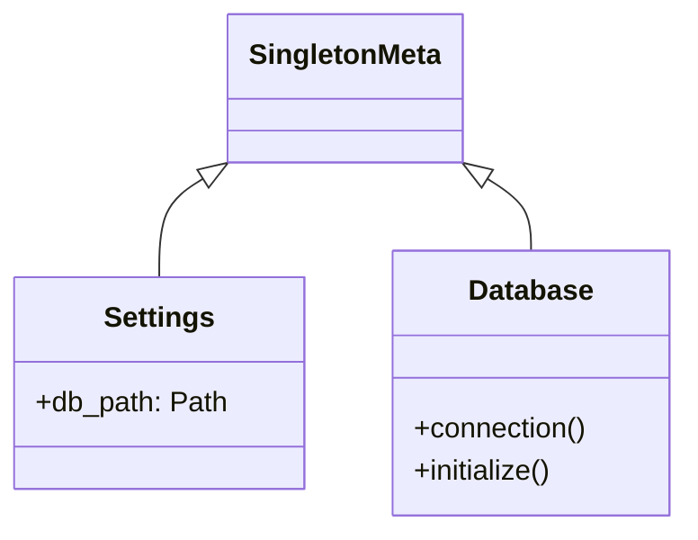

Фрагмент кода:

```python
class SingletonMeta(type):
    _instances: dict[type, object] = {}

    def __call__(cls, *args, **kwargs):
        if cls not in cls._instances:
            cls._instances[cls] = super().__call__(*args, **kwargs)
        return cls._instances[cls]


class Settings(metaclass=SingletonMeta):
    def __init__(self) -> None:
        self.db_path = Path(os.getenv("LAB6_DB_PATH", str(default_path)))
```

Применение: `backend/app/settings.py`, `backend/app/database.py`.

### 2. Builder

**Название:** Builder  
**Общее назначение:** пошагово собирать сложный объект, отделив процесс построения от конечного представления.  
**Назначение в проекте:** `MealBuilder` собирает агрегат `Meal` из API-запроса и из строк БД.

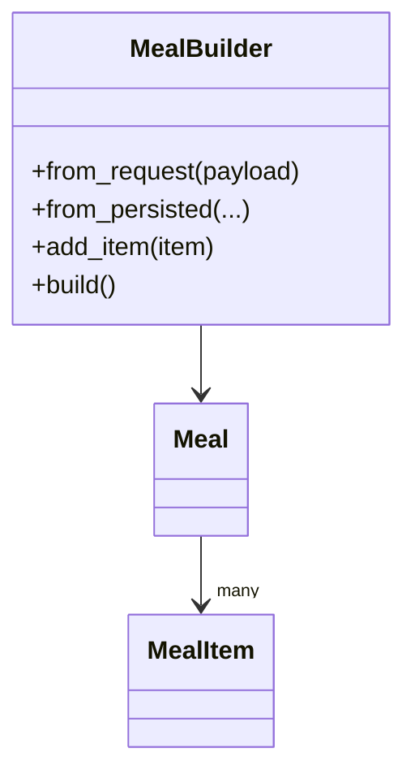

Фрагмент кода:

```python
class MealBuilder:
    def from_request(self, payload: MealCreateRequest) -> "MealBuilder":
        self.reset()
        self._user_id = payload.user_id
        self._meal_type = payload.meal_type
        self._meal_date = payload.meal_date
        self._original_text = payload.original_text
        for item in payload.items:
            self.add_item(item)
        return self
```

Применение: `backend/app/builders.py`, `backend/app/repositories.py`, `backend/app/commands.py`.

### 3. Abstract Factory

**Название:** Abstract Factory  
**Общее назначение:** создавать семейства связанных объектов без жёсткой привязки к их конкретным классам.  
**Назначение в проекте:** `SQLiteServiceFactory` создаёт согласованный набор инфраструктурных компонентов для текущего подключения: `MealRepository` и `ProductCatalog`.

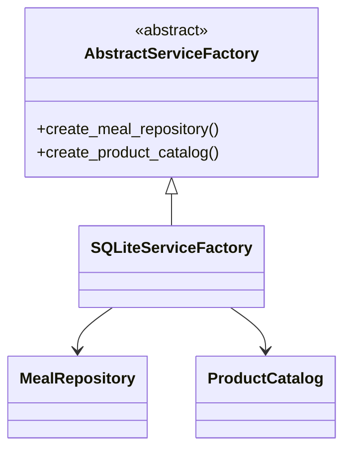

Фрагмент кода:

```python
class SQLiteServiceFactory(AbstractServiceFactory):
    def create_meal_repository(self) -> MealRepository:
        repository = SQLiteMealRepository(self._conn, self._builder)
        return LoggingMealRepository(repository, self._publisher)

    def create_product_catalog(self) -> ProductCatalog:
        provider = StaticNutritionProvider(self._conn)
        adapter = NutritionCatalogAdapter(provider)
        return CachedProductCatalogProxy(adapter)
```

Применение: `backend/app/repositories.py`, `backend/app/facade.py`.

## Структурные шаблоны

### 4. Adapter

**Название:** Adapter  
**Общее назначение:** согласовать несовместимые интерфейсы классов.  
**Назначение в проекте:** `NutritionCatalogAdapter` адаптирует низкоуровневый `StaticNutritionProvider`, возвращающий строки SQLite, к доменному интерфейсу `ProductCatalog`.

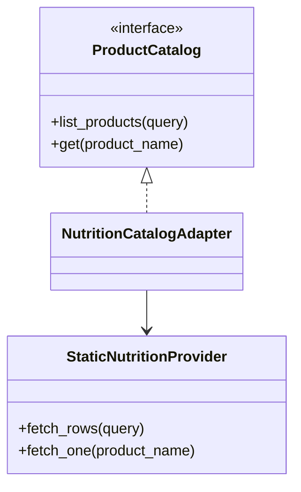

Фрагмент кода:

```python
class NutritionCatalogAdapter(ProductCatalog):
    def __init__(self, provider: StaticNutritionProvider) -> None:
        self._provider = provider

    def list_products(self, query: str | None = None) -> list[ProductInfo]:
        return [
            ProductInfo(
                product_name=row["name"],
                calories_per_100g=row["calories_per_100g"],
            )
            for row in self._provider.fetch_rows(query)
        ]
```

Применение: `backend/app/products.py`.

### 5. Facade

**Название:** Facade  
**Общее назначение:** предоставить упрощённый единый интерфейс к сложной подсистеме.  
**Назначение в проекте:** `CalorieDiaryFacade` скрывает детали команд, репозиториев, публикации событий и парсинга голосового ввода от HTTP-слоя.

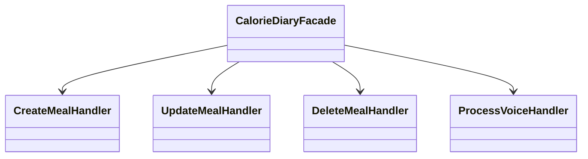

Фрагмент кода:

```python
class CalorieDiaryFacade:
    def create_meal(self, payload: MealCreateRequest) -> MealResponse:
        return self._create_handler.handle(CreateMealCommand(payload))

    def process_voice(self, payload: VoiceProcessRequest) -> MealResponse:
        return self._voice_handler.handle(ProcessVoiceCommand(payload))
```

Применение: `backend/app/facade.py`, `backend/app/main.py`.

### 6. Decorator

**Название:** Decorator  
**Общее назначение:** динамически добавлять объекту новые обязанности без изменения его класса.  
**Назначение в проекте:** `LoggingMealRepository` оборачивает базовый репозиторий и публикует доменные события после сохранения, изменения и удаления записей.

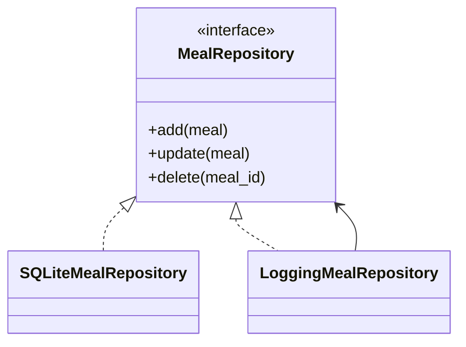

Фрагмент кода:

```python
class LoggingMealRepository(MealRepository):
    def add(self, meal: Meal) -> Meal:
        saved = self._inner.add(meal)
        self._publisher.publish("meal.saved", {"meal_id": str(saved.id)})
        return saved
```

Применение: `backend/app/repositories.py`.

### 7. Proxy

**Название:** Proxy  
**Общее назначение:** подставной объект контролирует доступ к реальному объекту.  
**Назначение в проекте:** `CachedProductCatalogProxy` кэширует обращения к каталогу продуктов и снижает число одинаковых запросов к БД.

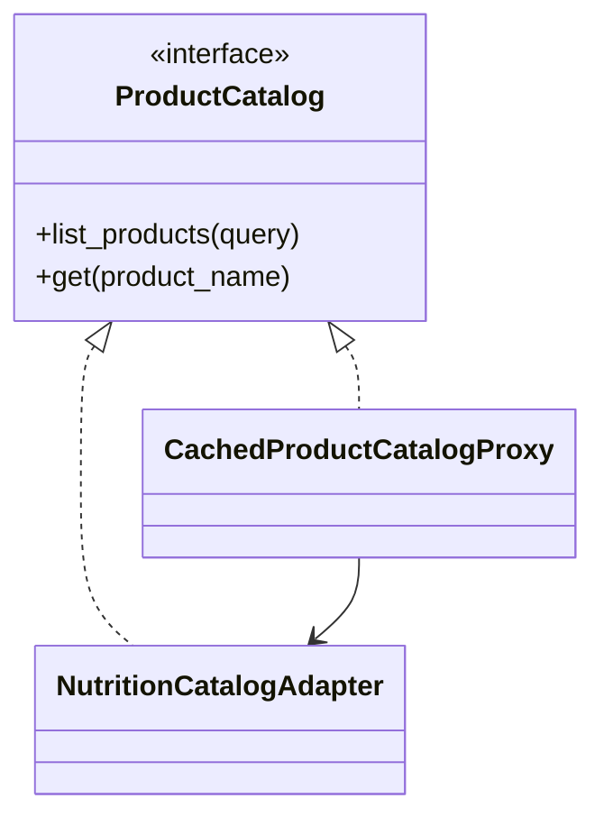

Фрагмент кода:

```python
class CachedProductCatalogProxy(ProductCatalog):
    def list_products(self, query: str | None = None) -> list[ProductInfo]:
        if query not in self._cache:
            self._cache[query] = self._inner.list_products(query)
        return list(self._cache[query])
```

Применение: `backend/app/products.py`.

## Поведенческие шаблоны

### 8. Strategy

**Название:** Strategy  
**Общее назначение:** инкапсулировать семейство алгоритмов и делать их взаимозаменяемыми.  
**Назначение в проекте:** `MealBuilder` использует стратегию расчёта калорий. Сейчас подключена `StandardCalorieStrategy`, но алгоритм можно заменить без изменения строителя.

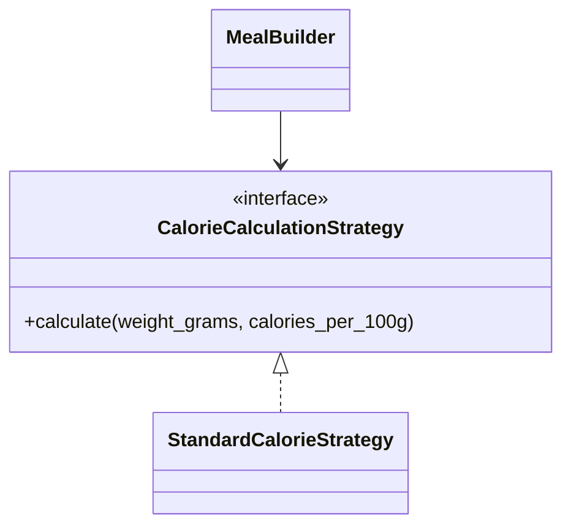

Фрагмент кода:

```python
class StandardCalorieStrategy(CalorieCalculationStrategy):
    def calculate(self, weight_grams: int, calories_per_100g: int) -> int:
        return round(weight_grams * calories_per_100g / 100)
```

Применение: `backend/app/strategies.py`, `backend/app/builders.py`.

### 9. Command

**Название:** Command  
**Общее назначение:** представить запрос как объект, чтобы параметризовать клиентов действиями и отделить отправителя от исполнителя.  
**Назначение в проекте:** операции записи оформлены как команды `CreateMealCommand`, `UpdateMealCommand`, `DeleteMealCommand`, `ProcessVoiceCommand`.

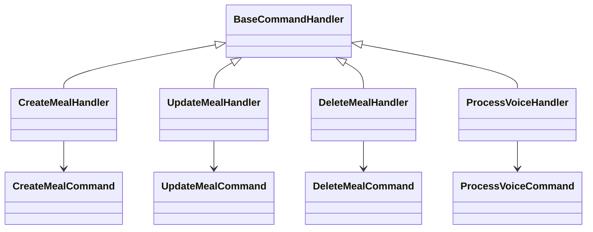

Фрагмент кода:

```python
@dataclass(slots=True)
class CreateMealCommand:
    payload: MealCreateRequest


class CreateMealHandler(BaseCommandHandler):
    def execute(self, command: CreateMealCommand, factory: AbstractServiceFactory) -> MealResponse:
        meal = self._builder.from_request(command.payload).build()
        saved = factory.create_meal_repository().add(meal)
        return saved.to_response()
```

Применение: `backend/app/commands.py`, `backend/app/facade.py`.

### 10. Template Method

**Название:** Template Method  
**Общее назначение:** определить каркас алгоритма в базовом классе и делегировать шаги подклассам.  
**Назначение в проекте:** `BaseCommandHandler.handle()` задаёт единый сценарий выполнения команды: открыть подключение, собрать фабрику, вызвать `execute`.

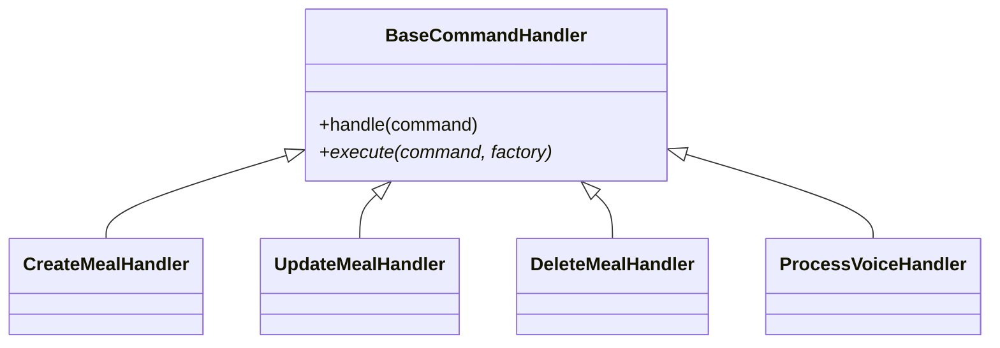

Фрагмент кода:

```python
class BaseCommandHandler(ABC):
    def handle(self, command):
        with self._database.connection() as conn:
            factory = self._factory_builder(conn)
            return self.execute(command, factory)

    @abstractmethod
    def execute(self, command, factory: AbstractServiceFactory):
        raise NotImplementedError
```

Применение: `backend/app/commands.py`.

### 11. Observer

**Название:** Observer  
**Общее назначение:** определить зависимость один-ко-многим, чтобы подписчики автоматически получали уведомления о событиях.  
**Назначение в проекте:** `DomainEventPublisher` уведомляет подписчиков (`AuditLogSubscriber`) о событиях жизненного цикла записей питания.

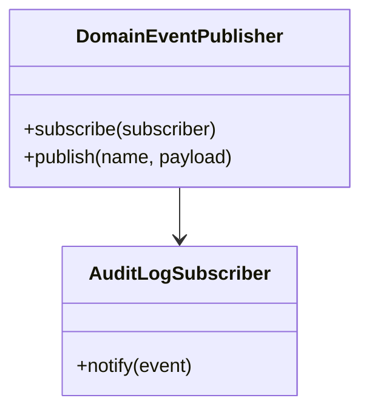

Фрагмент кода:

```python
class DomainEventPublisher:
    def subscribe(self, subscriber: EventSubscriber) -> None:
        self._subscribers.append(subscriber)

    def publish(self, name: str, payload: dict[str, Any]) -> None:
        event = DomainEvent(name=name, payload=payload, occurred_at=datetime.now(timezone.utc))
        for subscriber in self._subscribers:
            subscriber.notify(event)
```

Применение: `backend/app/events.py`, `backend/app/facade.py`, `backend/app/repositories.py`.

### 12. Chain of Responsibility

**Название:** Chain of Responsibility  
**Общее назначение:** передавать запрос по цепочке обработчиков, пока один или несколько из них не обработают запрос.  
**Назначение в проекте:** голосовая фраза проходит через цепочку `ChickenVoiceHandler -> AppleVoiceHandler -> FallbackVoiceHandler`.

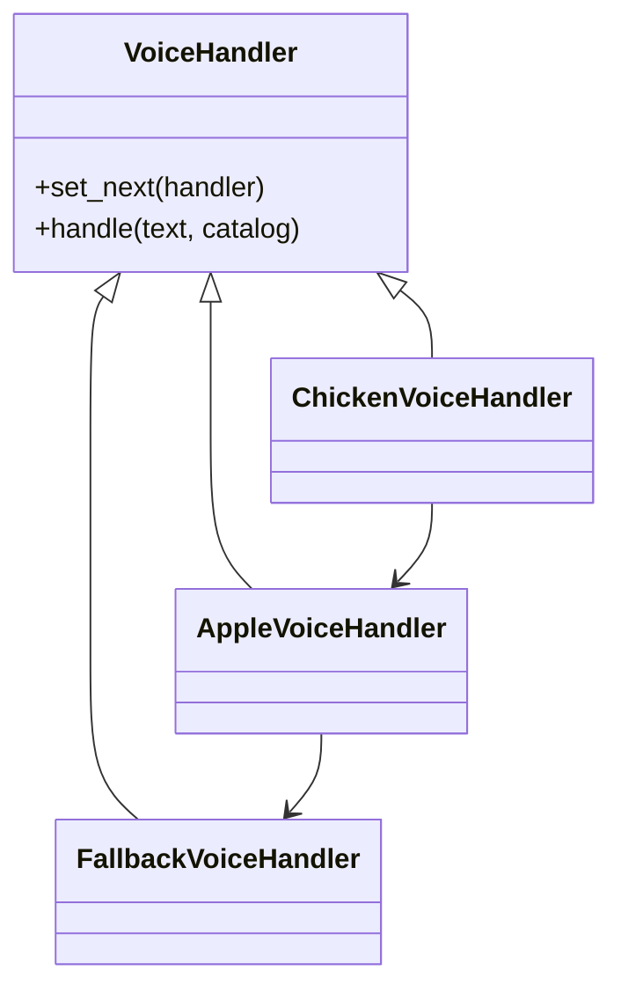

Фрагмент кода:

```python
def build_voice_chain() -> KeywordVoiceParser:
    chicken = ChickenVoiceHandler()
    apple = AppleVoiceHandler()
    fallback = FallbackVoiceHandler()
    chicken.set_next(apple).set_next(fallback)
    return KeywordVoiceParser(chicken)
```

Применение: `backend/app/voice.py`.

---

## Шаблоны проектирования GRASP

## Роли (обязанности) классов

### 1. Controller

**Проблема:** HTTP-слой не должен напрямую управлять всей бизнес-логикой.  
**Решение:** `CalorieDiaryFacade` принимает запросы от `main.py` и координирует нужные команды и запросы.  
**Пример кода:**

```python
@app.post("/api/v1/meals")
def create_meal(payload: MealCreateRequest) -> MealResponse:
    return facade.create_meal(payload)
```

**Результат:** контроллеры FastAPI остаются тонкими.  
**Связь с другими паттернами:** Facade, Command.

### 2. Creator

**Проблема:** нужен единый ответственный за создание объекта `Meal`.  
**Решение:** объект создаёт `MealBuilder`, так как он владеет всеми шагами сборки и вычислением вложенных элементов.  
**Пример кода:**

```python
meal = self._builder.from_request(command.payload).build()
```

**Результат:** исключено дублирование логики конструирования.  
**Связь с другими паттернами:** Builder, Strategy.

### 3. Information Expert

**Проблема:** кто должен знать, как получить суммарную калорийность?  
**Решение:** агрегат `Meal` сам вычисляет `total_calories`, так как содержит коллекцию `items`.  
**Пример кода:**

```python
@property
def total_calories(self) -> int:
    return sum(item.calories_total for item in self.items)
```

**Результат:** логика находится рядом с данными, которыми она оперирует.  
**Связь с другими паттернами:** Builder, Repository.

### 4. Pure Fabrication

**Проблема:** доменные сущности не должны брать на себя инфраструктурные обязанности.  
**Решение:** введены искусственные, но полезные классы `SQLiteMealRepository`, `DomainEventPublisher`, `CalorieDiaryFacade`.  
**Пример кода:**

```python
class SQLiteMealRepository(MealRepository):
    ...
```

**Результат:** доменная модель остаётся компактной и предметно-ориентированной.  
**Связь с другими паттернами:** Repository-like abstraction, Observer, Facade.

### 5. Indirection

**Проблема:** прямое связывание API с SQLite и голосовым парсером усложнило бы замену компонентов.  
**Решение:** между слоями введены `AbstractServiceFactory`, `MealRepository`, `ProductCatalog`, `KeywordVoiceParser`.  
**Пример кода:**

```python
catalog = factory.create_product_catalog()
items = self._voice_parser.parse(command.payload.text, catalog)
```

**Результат:** изменения локализуются в инфраструктурном слое.  
**Связь с другими паттернами:** Abstract Factory, Adapter, Proxy.

## Принципы разработки

### 1. Low Coupling

**Проблема:** изменение БД, каталога продуктов или обработчика команд не должно ломать весь сервис.  
**Решение:** зависимости проходят через абстракции `MealRepository`, `ProductCatalog`, `AbstractServiceFactory`.  
**Пример кода:**

```python
class AbstractServiceFactory(ABC):
    @abstractmethod
    def create_meal_repository(self) -> MealRepository:
        raise NotImplementedError
```

**Результат:** низкая связность и упрощённая замена реализации.  
**Связь с другими паттернами:** Abstract Factory, Adapter, Proxy.

### 2. High Cohesion

**Проблема:** если один класс делает всё сразу, он быстро становится монолитным и трудноподдерживаемым.  
**Решение:** обязанности распределены по специализированным модулям: `builders.py`, `commands.py`, `products.py`, `events.py`, `voice.py`.  
**Пример кода:**

```python
class KeywordVoiceParser:
    def parse(self, text: str, catalog: ProductCatalog) -> list[MealItemIn]:
        ...
```

**Результат:** классы компактны и меняются по одной причине.  
**Связь с другими паттернами:** Chain of Responsibility, Strategy, Command.

### 3. Protected Variations

**Проблема:** система должна быть устойчива к изменениям алгоритмов расчёта и способов получения продуктов.  
**Решение:** вариативные части спрятаны за интерфейсами и шаблонами.  
**Пример кода:**

```python
class CalorieCalculationStrategy(ABC):
    @abstractmethod
    def calculate(self, weight_grams: int, calories_per_100g: int) -> int:
        raise NotImplementedError
```

**Результат:** можно заменить алгоритм без переписывания API-слоя.  
**Связь с другими паттернами:** Strategy, Adapter, Abstract Factory.

## Свойство программы (цель)

### Полиморфизм

**Проблема:** разные варианты поведения должны вызываться единообразно.  
**Решение:** система работает через полиморфные интерфейсы `MealRepository`, `ProductCatalog`, `CalorieCalculationStrategy`, `VoiceHandler`.  
**Пример кода:**

```python
class VoiceHandler(ABC):
    @abstractmethod
    def _try_handle(self, text: str, catalog: ProductCatalog) -> list[MealItemIn]:
        raise NotImplementedError
```

**Результаты:** достигается расширяемость, читаемость и повторное использование кода.  
**Связь с другими паттернами:** Strategy, Chain of Responsibility, Decorator, Adapter.

---

## Итог

В рамках ЛР6 в проекте реализованы:

- **Порождающие шаблоны:** Singleton, Builder, Abstract Factory.
- **Структурные шаблоны:** Adapter, Facade, Decorator, Proxy.
- **Поведенческие шаблоны:** Strategy, Command, Template Method, Observer, Chain of Responsibility.
- **GRASP:** 5 ролей, 3 принципа, 1 свойство программы.

Практический результат:

- HTTP-слой стал тонким;
- код разделён на предметный, инфраструктурный и прикладной уровни;
- добавлена расширяемость для БД, алгоритмов расчёта и обработки голосового ввода;
- работоспособность подтверждена автотестами.
